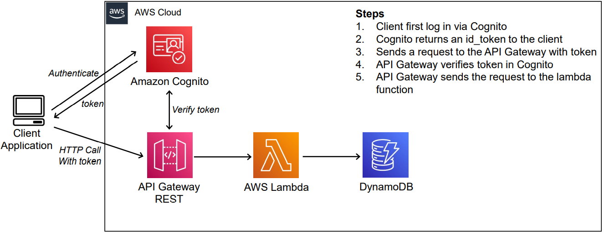
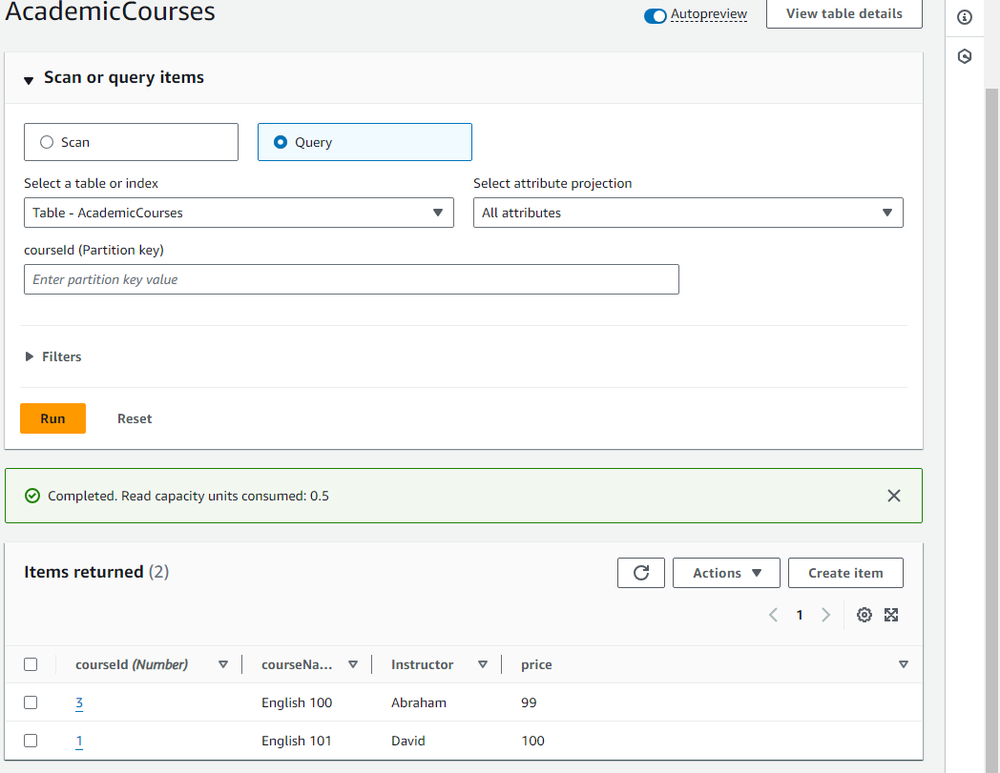
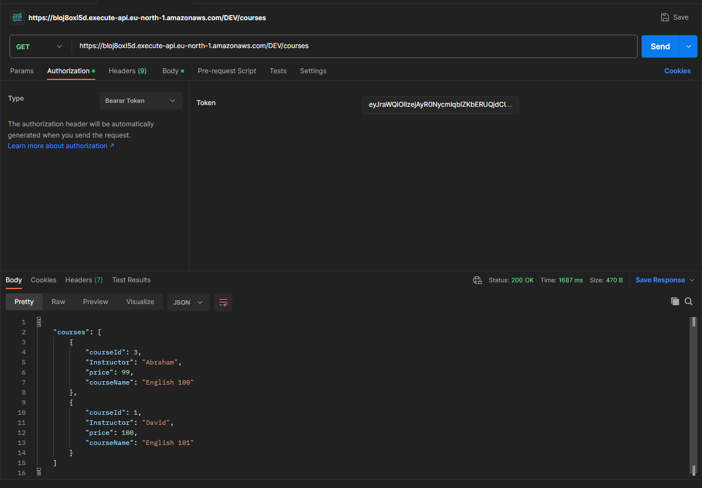
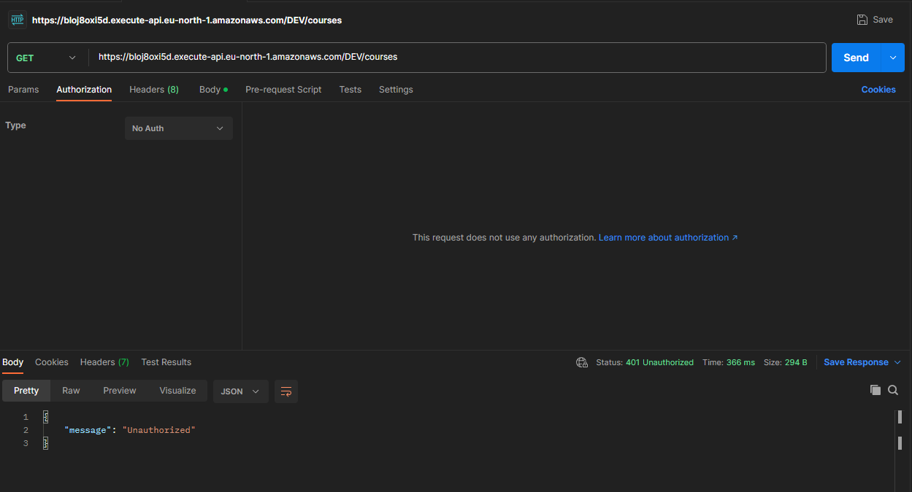
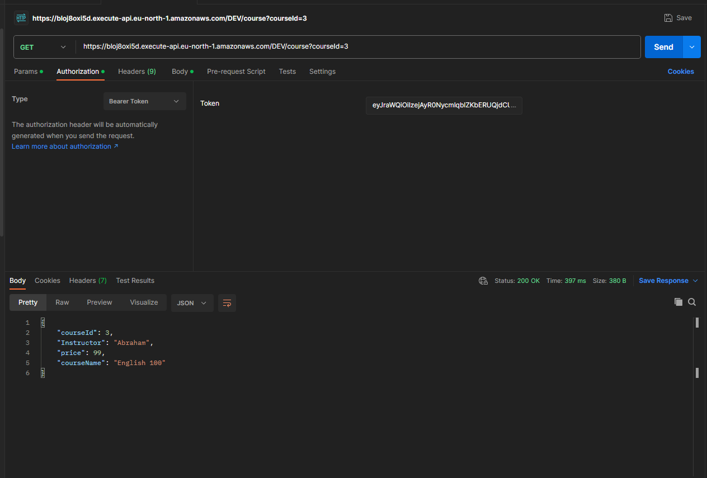
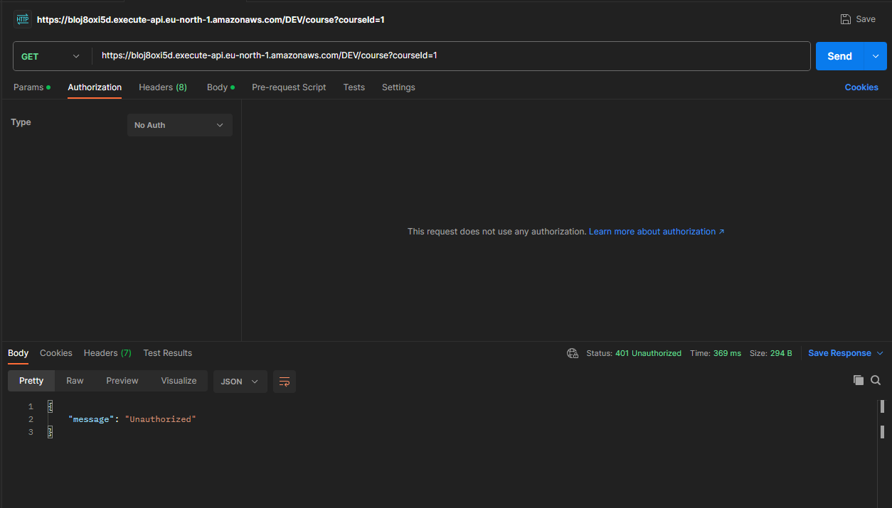
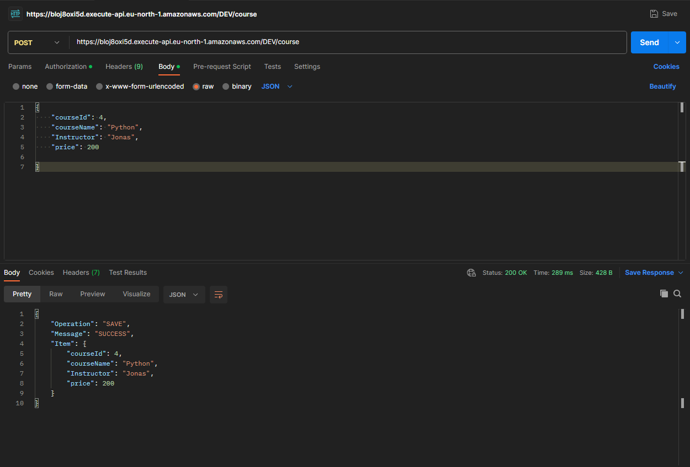
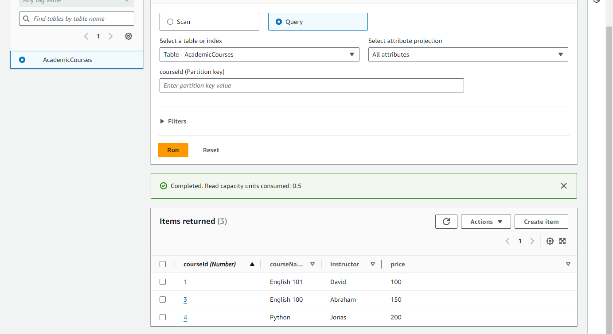
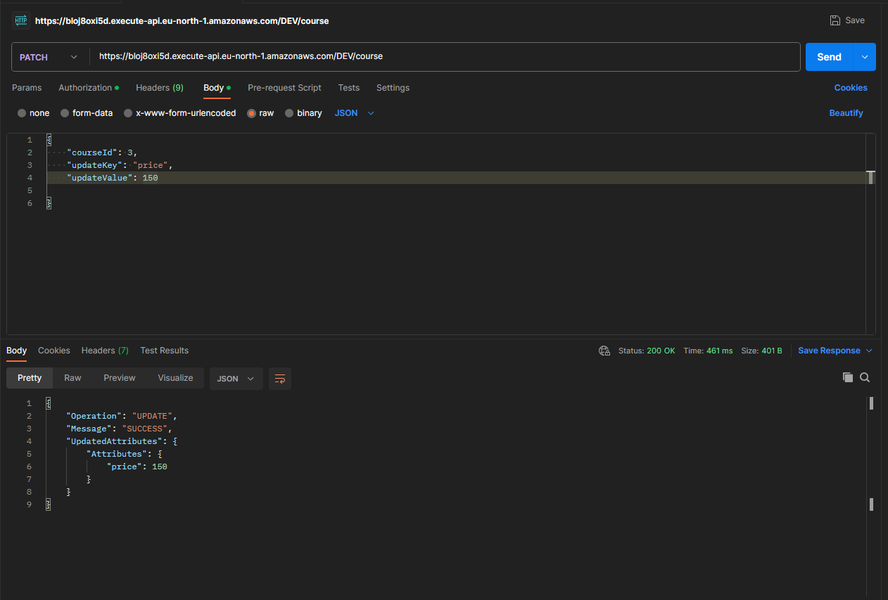

# Wasla-Task

  

# Academic Courses Lambda Function

This AWS Lambda function handles requests related to academic courses and interacts with a DynamoDB table.

## Overview

The Lambda function provides the following functionality:

- **Health Check Endpoint:** `/health` - Returns a 200 OK response for health checks.

- **Get Course by ID:** `/course` - Retrieves information about a specific course based on the provided course ID.

- **Get All Courses:** `/courses` - Retrieves information about all courses.

- **Save Course:** `POST /course` - Saves a new course to the DynamoDB table.

- **Modify Course:** `PATCH /course` - Modifies attributes of an existing course.

- **Delete Course:** `DELETE /course` - Deletes a course based on the provided course ID.

## Configuration

The Lambda function is configured with the following settings:

- **AWS Region:** `eu-north-1`

- **DynamoDB Table Name:** `AcademicCourses`

## Usage

### GET /health

Health check endpoint to verify the function's availability.

### GET /course?courseId={courseId}

Retrieve information about a specific course by providing the course ID as a query parameter.

### GET /courses

Retrieve information about all available courses.

### POST /course

Save a new course by sending a JSON payload in the request body.

### PATCH /course

Modify attributes of an existing course by providing the course ID, update key, and update value in the request body.

### DELETE /course

Delete a course based on the provided course ID.

---

## AcademicCourses Table IN DynamoDB

  

---

## Get All Courses Endpoint

  
  

  <em>Figure 1: Comparison of getCoursesAuthorized and getCoursesUnauthorized</em>

---

## Get Specific Course Endpoint

  
  

  <em>Figure 2: Comparison of getSpecificCourseAuthorized and getSpecificCourseUnauthorized</em>

---

## POST New Course To DB

  
  

  <em>Figure 3: Comparison of AddingCourse and afterAddingCourseInDB</em>

---

## PATCH(update) Course In DB

  

---

## Dependencies

- **AWS SDK for JavaScript in Node.js:** Used for interacting with AWS services.

## How to Deploy

1. Ensure that the AWS SDK is properly configured with the necessary credentials.

2. Deploy the Lambda function using the AWS Management Console or the AWS CLI.

## Author

Mohamed Hany Zakaria

## License

# GNU Affero General Public License v3.0

This project is licensed under the GNU Affero General Public License v3.0 - see the [LICENSE.md](LICENSE.md) file for details.
